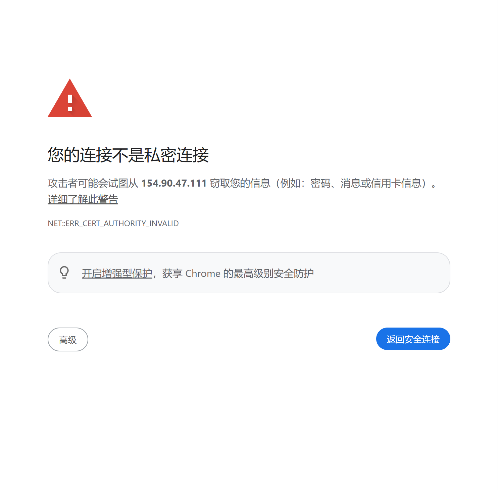
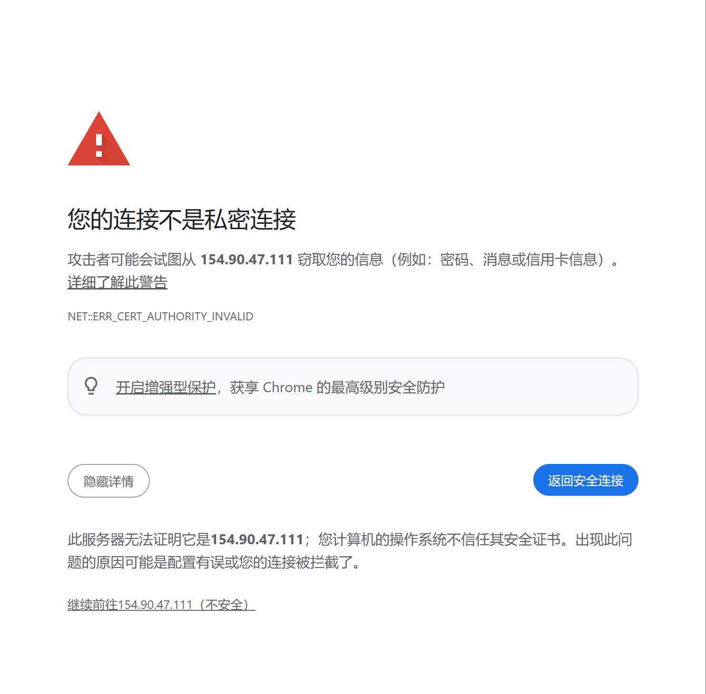
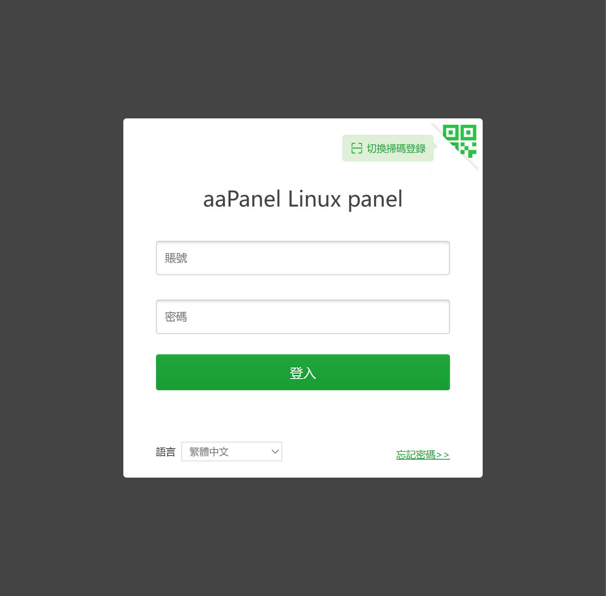
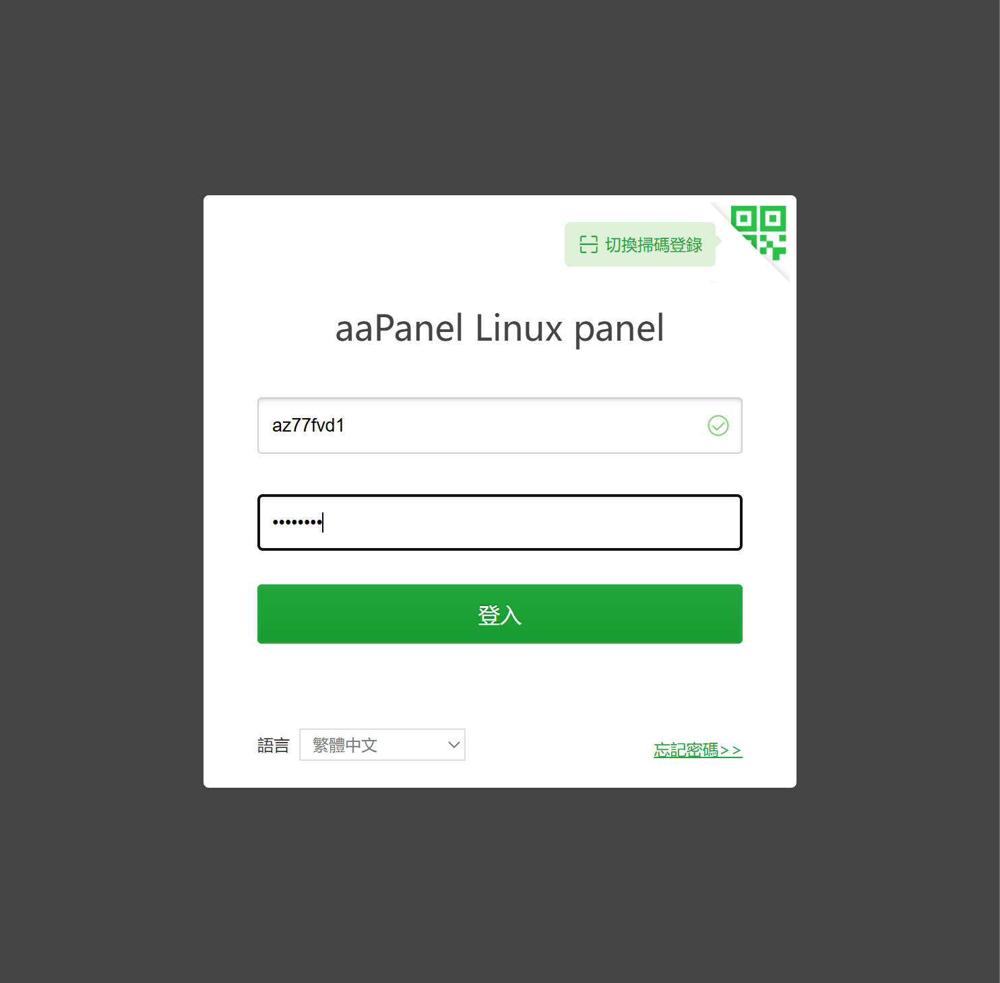
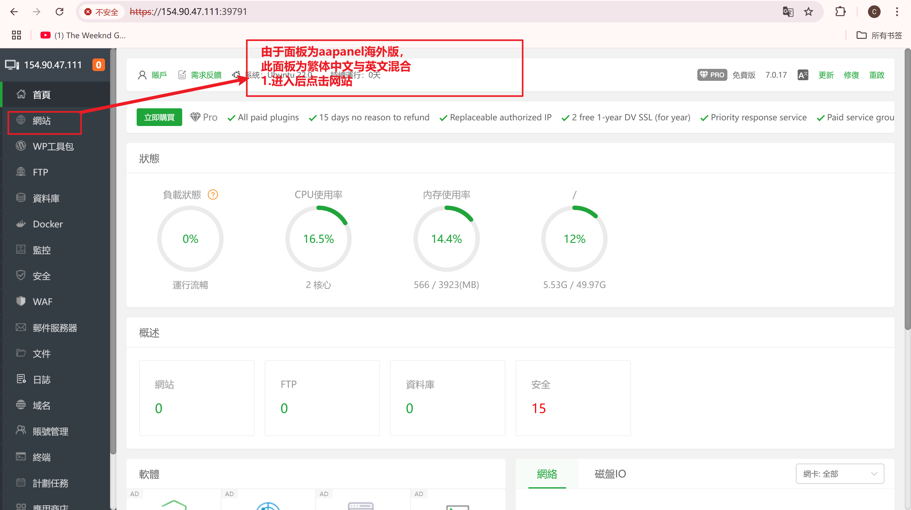
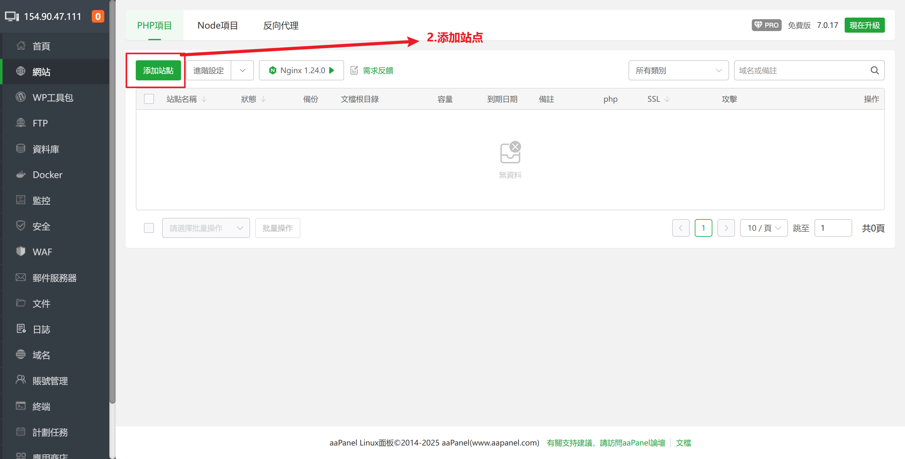
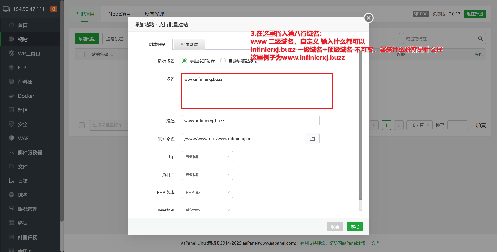

 ## Moon

nuomiazz@gmail.com

shabi123..

### 04/03

#### 日志

```markdown
垫付1240r服务器费用
目标10套
```

#### 服务器

```markdown
URL=https://www.aapanel.com/script/install_7.0_en.sh && if [ -f /usr/bin/curl ];then curl -ksSO "$URL" ;else wget --no-check-certificate -O install_7.0_en.sh "$URL";fi;bash install_7.0_en.sh aapanel

泰国
主机ip:38.54.33.22
服务器账号:root 
服务器密码:ik2G0VB38P#n
aaPanel Internet Address: https://38.54.33.22:29249/2e593a26
username: zgr02oyi
password: c79a449a
域名:infinierxa.buzz


泰国
主机ip:38.54.82.249
服务器账号:root 
服务器密码:aJDATVt8P#n
aaPanel Internet Address: https://38.54.82.249:26705/2847009a
username: fdhuegmk
password: e32efdc5
域名:infinierxb.buzz


泰国
主机ip:38.54.118.206
服务器账号:root 
服务器密码:41sorRQs8P#n
aaPanel Internet Address: https://38.54.118.206:40764/cb3ee5a7
username: ujm1tvs7
password: 7d5a59a1
域名:infinierxc.buzz


泰国
主机ip:38.60.254.18
服务器账号:root 
服务器密码:X00924lp8P#n
aaPanel Internet Address: https://38.60.254.18:15813/90cd335d
username: gdxztbi8
password: cdd11a27
域名:infinierxd.buzz


泰国
主机ip:38.54.32.17
服务器账号:root 
服务器密码:YVlY2LzR8P#n
aaPanel Internet Address: https://38.54.32.17:28940/e8ed672d
username: 5md4nr5t
password: 5bb49b84
域名:infinierxe.buzz


泰国
主机ip:38.60.254.138
服务器账号:root 
服务器密码:v2b500TP8P#n
aaPanel Internet Address: https://38.60.254.138:11880/86754eb9
username: rfhibiiz
password: 5fc286f1
域名:infinierxf.buzz


泰国
主机ip:154.90.46.166
服务器账号:root 
服务器密码:RefYBQ7B8P#n
aaPanel Internet Address: https://154.90.46.166:27189/dece435d
username: ckqkmbbo
password: 6b0ab879
域名:infinierxg.buzz


泰国
主机ip:38.54.118.67
服务器账号:root 
服务器密码:Xz7KimMb8P#n
aaPanel Internet Address: https://38.54.118.67:41818/84f56a6f
username: squq4c0x
password: 42e25c8b
域名:infinierxh.buzz


泰国
主机ip:154.90.44.45
服务器账号:root 
服务器密码:OozZl1xY8P#n
aaPanel Internet Address: https://154.90.44.45:34170/bfc8b82c
username: mydq0uta
password: b259b18b
域名:infinierxi.buzz


泰国
主机ip:154.90.47.111
服务器账号:root 
服务器密码:pGYAs6LX8P#n
aaPanel Internet Address: https://154.90.47.111:39791/38a201d0
username: az77fvd1
password: 1b34bb25
域名:infinierxj.buzz
```

#### 域名

160.20

```markdown
infinierxa.buzz
infinierxb.buzz
infinierxc.buzz
infinierxd.buzz
infinierxe.buzz

infinierxf.buzz
infinierxg.buzz
infinierxh.buzz
infinierxi.buzz
infinierxj.buzz
```


### 账单

```markdown
1240+160.20+200 = 1600.2
```

```markdown
泰国
主机ip:154.90.47.111
服务器账号:root 
服务器密码:pGYAs6LX8P#n
aaPanel Internet Address: https://154.90.47.111:39791/38a201d0
username: az77fvd1
password: 1b34bb25
域名:infinierxj.buzz

以上方服务器为例
主要使用第五行aaPanel Internet Address:面板地址，直接放到浏览器进入面板，如果出现不是私密链接页面，点击下方“高级按钮”

```

1.



2.

```markdown
进入面板后登录，用第六行的账号(username:后的字符)，第七行的密码(password:后的字符)进行登录
```

3.

4.

5.

6.

7.

8.点击确定